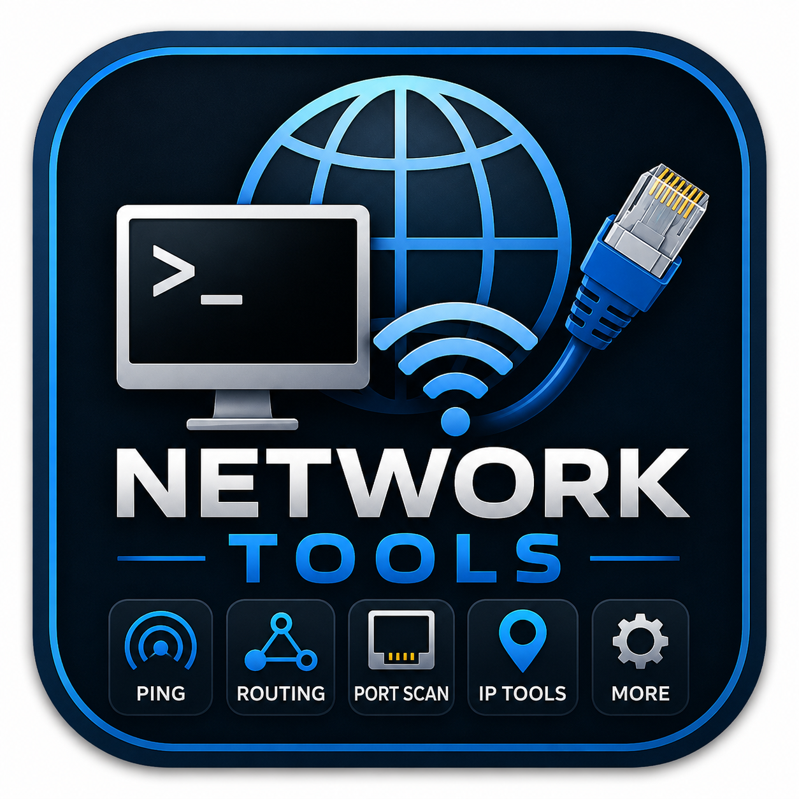
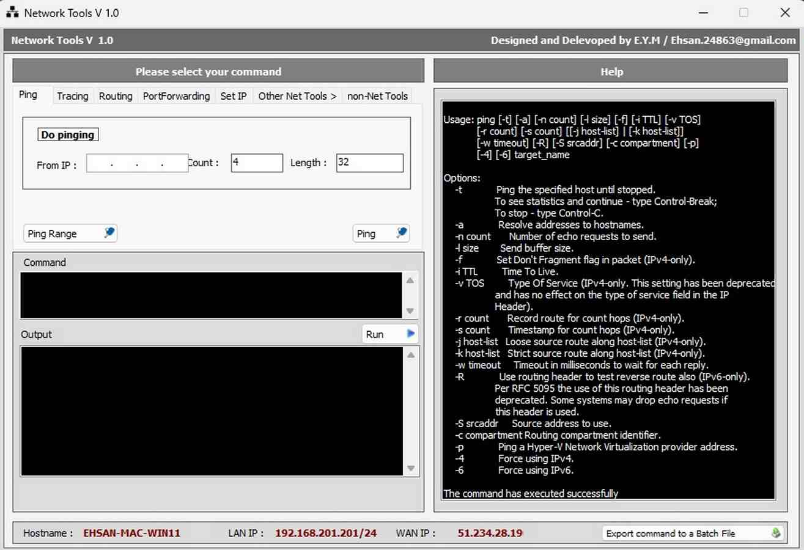
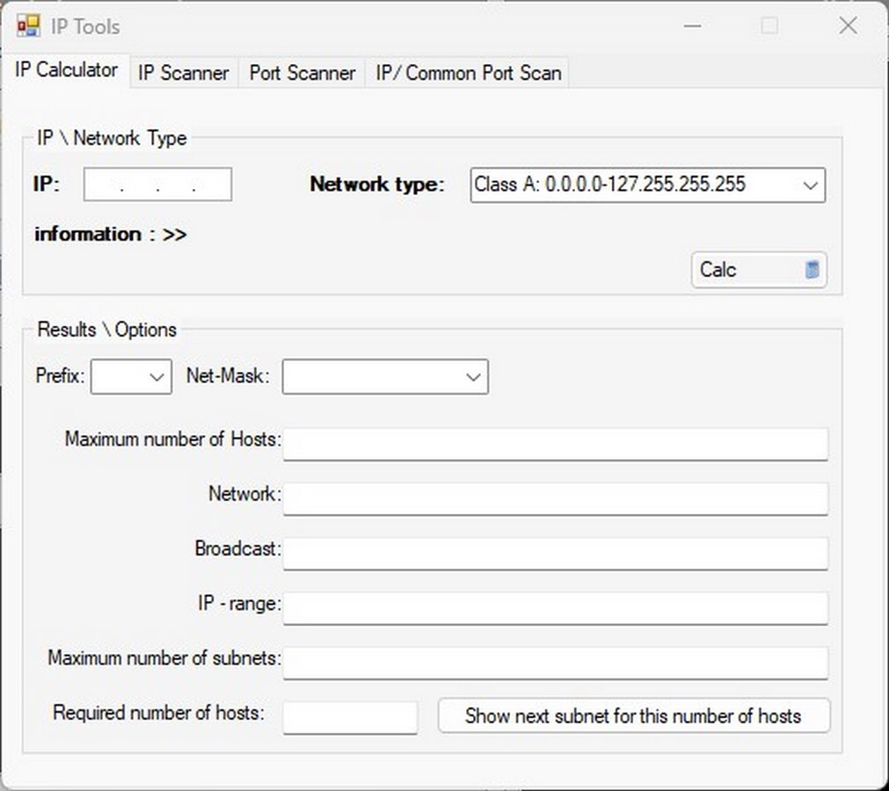
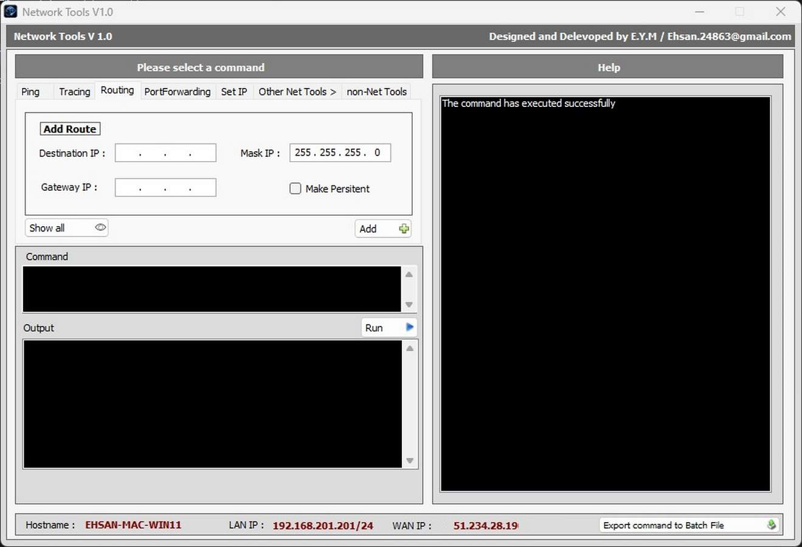
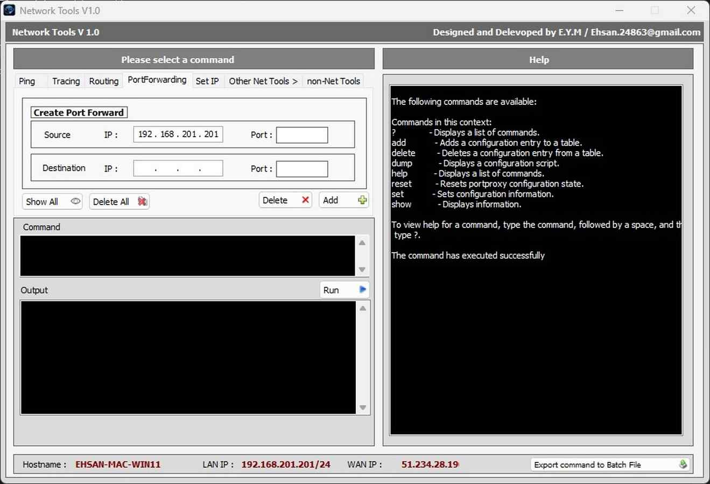
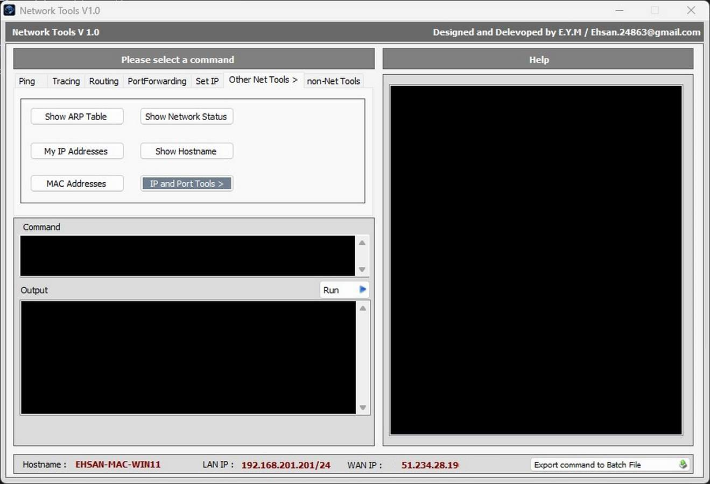
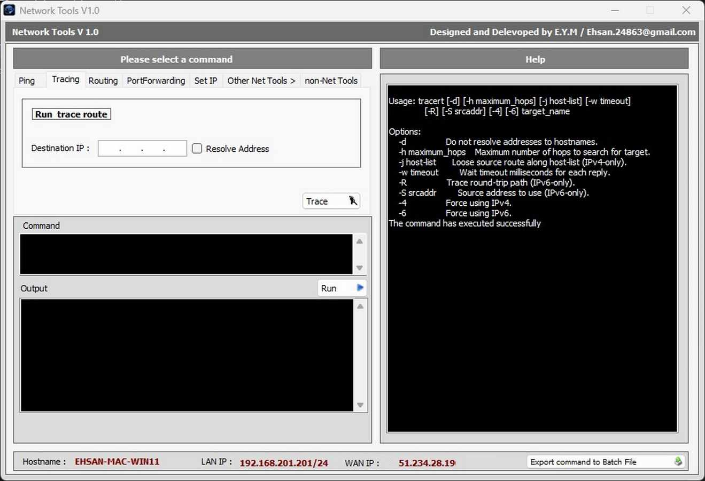

# Network Tools

A lightweight and portable network utility for Windows administrators, IT professionals, and network engineers.

  

---

## Features

- 🌐 Ping Host
- 📍 Traceroute
- 🛣 Route Management
- 🔀 Port Forwarding
- 💻 IP Configuration
- 🧮 IP Calculator
- 🔍 IP Scanner
- 🔌 Port Scanner
- 📡 ARP Table Viewer
- 📊 Netstat Viewer
- 🖥 Hostname Viewer
- 🔗 MAC Address Viewer
- 📤 Export Commands to Batch File
- 📖 Built-in Help

---

## Screenshots

| Main Window | IP Calculator |
|-------------|---------------|
|  |  |

| Routing | Port Forwarding |
|----------|-----------------|
|  |  |

| Network Tools | Traceroute |
|---------------|------------|
|  |  |

---

## Requirements

- Windows XP / Vista / 7 / 8 / 10 / 11
- Microsoft .NET Framework 2.0 or later

> **Note:** If the application does not start, install Microsoft .NET Framework 2.0 (or a newer version).

---

## Installation

1. Download the latest release.
2. Extract the ZIP file.
3. Run **NET_NETTOOLS_V1.0.exe**.

No installation is required.

---

## Why Network Tools?

Network Tools combines several common Windows networking utilities into a single lightweight application.

Instead of remembering command-line syntax, simply select the desired operation and execute it through an easy-to-use graphical interface.

---

## Version

Current Version: **v1.0**

---

## License

Copyright © 2026 Ehsan

All Rights Reserved.

This software may be used for personal and educational purposes.

Redistribution or modification without permission is prohibited.

---

## Author

Developed by **Ehsan.y.m**

If you like this project, don't forget to ⭐ the repository.